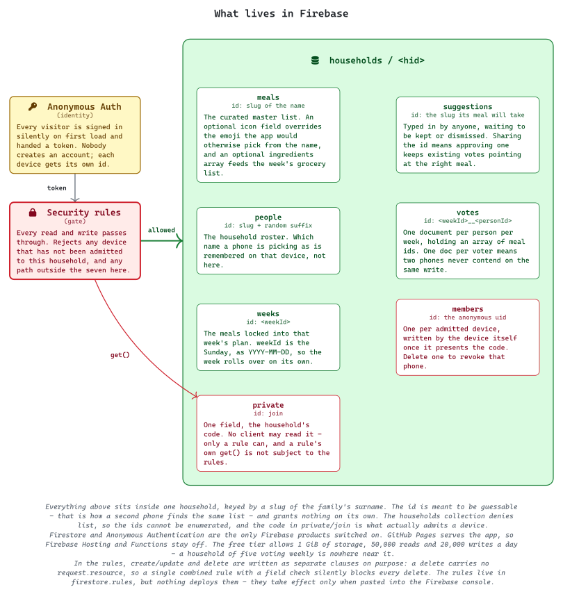

# What's For Dinner

A one-page dinner picker for the family.
Everyone opens the same link on their own phone, taps the meals they'd be happy to eat this week, and whoever does the shopping sees a live tally.

**→ [superrcharge.github.io/dinner-decisions](https://superrcharge.github.io/dinner-decisions/)**

No sign-in, no accounts, no app to install. Any phone, any browser.

## How it works

- **Pick meals** - tap tiles to vote. Everything you've chosen is gathered into a **Your picks** strip at the top, so you can read your own selections back without hunting for green tiles. Type anything that isn't on the list and it joins that week's options straight away.
- **Shopping** - meals ranked by votes, with who picked each one and who hasn't voted yet. Build the week's plan by tapping *Add*.
- **Manage** - hidden behind a code. Edit the master meal list, keep or dismiss what the kids suggested, set a meal's icon, clear the week.

The tab strip sticks to the top of the screen, so the three views stay reachable however far down the list you've scrolled.

The week rolls over on its own every Sunday. Nobody has to reset anything.

**First time on a phone:** tap **Picking as** in the top right and choose your name, or add it. That's remembered on that device, so it's a one-time step.

## Installing it on a phone

Safari: share menu → *Add to Home Screen*. Chrome: ⋮ → *Add to Home screen*.

It installs as **Dinner Decisions** with a pot icon and opens without browser chrome, so it behaves like an app rather than a bookmark.

That has one consequence worth knowing: a page running standalone has **no address bar and no pull-to-refresh**. That's why the bottom bar carries a **Reload** button, and why a green *"A newer version is ready"* strip appears on its own when new code has shipped. Without those, the only way to update would be to force-quit the app.

The version check deliberately asks for the same copy a reload would get, rather than going straight to the origin. Querying the origin would let it announce a version that a reload can't actually fetch yet - so it would prompt, you'd reload, nothing would change, and it would prompt again.

## How a meal gets its icon

Icons aren't stored and aren't looked up - they're worked out in the browser from the meal's name every time a tile renders.

1. A keyword table maps names to glyphs, most specific first, so *Chicken Alfredo* matches `alfredo` (🍝) before it reaches `chicken` (🍗).
2. Anything unmatched falls back to a neutral 🍴.
3. **Manage → Icon** overrides it: paste any emoji and it's written to that meal's `icon` field, which wins over the matcher and reaches every phone in about a second.

The override is the normal way to fix a glyph - it needs no code change and no deploy. Editing the keyword table only makes sense for a whole category that keeps recurring.

The Icon button appears on meals in the master list, not on pending suggestions, so *Keep* one first and then set its icon.

## How it's put together

Two moving parts that never talk to each other: GitHub serves the code, Firestore holds the data, and the page in the browser is the only thing that touches both.

<picture>
  <source media="(prefers-color-scheme: dark)" srcset="./diagrams/runtime-dark.svg">
  
</picture>

Deploying a change is a push.

<picture>
  <source media="(prefers-color-scheme: dark)" srcset="./diagrams/hosting-dark.svg">
  
</picture>

## Firebase

Project **`dinner-decisions-6af97`**.

<picture>
  <source media="(prefers-color-scheme: dark)" srcset="./diagrams/firebase-dark.svg">
  
</picture>

Two products are switched on and the rest are deliberately off:

| Product | State | Why |
|---|---|---|
| Cloud Firestore | on | the shared data, with realtime listeners |
| Anonymous Authentication | on | gives every visitor an identity without an account |
| Firebase Hosting | **off** | GitHub Pages serves the app |
| Cloud Functions | **off** | there is no server-side logic |

**Anonymous auth** means nobody signs up and nobody has a password. On first load the SDK silently mints an identity for that browser and hands back a token. It exists so the rules have something to check - it is not a login, and it does not identify a *person*. Which family member a phone is picking as is a separate thing entirely, chosen from the roster and remembered in that device's `localStorage`.

### Deploying the rules

> **`firestore.rules` is not deployed by anything.**
> The file in this repo is the source of truth for humans, but pushing it changes nothing. The rules only take effect when pasted into **Firebase console → Firestore → Rules → Publish**. Edit the file and the console together, or they will drift.

The rules require an authenticated (anonymous) user and confine writes to the five collections below. `create`/`update` and `delete` are written as separate clauses on purpose: a delete carries no `request.resource`, so a single combined rule with a field check silently blocks every delete - removing a meal, dismissing a suggestion, clearing a week.

Because the site is public, anyone with the link can read and write these lists. For a household dinner list the worst case is a stranger adding a joke meal.

### Free tier

1 GiB of storage, 50,000 reads and 20,000 writes per day, and anonymous sign-in at no cost. A family of five voting weekly is nowhere near any of those.

### Recreating it from scratch

1. Create a Firebase project (skip Analytics).
2. **Firestore Database → Create database**, production mode, any US region.
3. **Authentication → Sign-in method → Anonymous → Enable.**
4. **Project settings → Your apps → `</>`** and copy the config into `FIREBASE_CONFIG` in `index.html`.
5. Paste `firestore.rules` into the console and publish.

## Firestore data model

Collections, all top level:

| Collection | Document id | Holds |
|---|---|---|
| `meals` | slug of the name | the master list. Optional `icon` field overrides the matched emoji |
| `suggestions` | slug of the name | typed-in meals awaiting keep or dismiss |
| `people` | slug plus a random suffix | the household roster |
| `votes` | `<weekId>__<personId>` | one document per person per week, holding an array of meal ids |
| `weeks` | `<weekId>` | the meals locked into that week's plan |

`weekId` is the Sunday of the week, as `YYYY-MM-DD`.

A suggestion is given the same id its meal will have, so approving one is a copy across collections and existing votes keep pointing at the right thing.

One document per voter per week means two phones never contend on the same write, which matters because Firestore is last-writer-wins with no transactions.

## Layout

Single static file, `index.html`. No build step, no dependencies to install, nothing to run locally - open it and it works.

```
index.html          the whole app
site.webmanifest    home-screen name and icons
firestore.rules     reference copy; paste into the console to apply
icons/              home-screen and favicon PNGs, generated from icon.typ
diagrams/           Typst sources and rendered SVGs
  design/           palette and tokens shared by every diagram
```

## Configuration

Two things in `index.html`:

- `FIREBASE_CONFIG` - the web app config from the Firebase console. The `apiKey` is not a secret; it identifies the project. Access is controlled by the security rules.
- `MANAGE_PIN` - the code that reveals the Manage tab. It hides Manage from the kids' phones. It is **not** security: it sits in the page source of a public repo, so anyone who opens dev tools can read it.

## Regenerating

```bash
mise run render   # diagrams → dual-theme SVGs
mise run icons    # home-screen and favicon PNGs
```

Diagrams need `typst` and the **CaskaydiaMono NFP** font. Each source compiles once per theme, and the fixed pt dimensions are stripped so the SVGs scale to the README's width. Icons need a colour emoji font - Segoe UI Emoji on Windows, Apple Color Emoji on macOS - and compile at 72 ppi so the page size in points equals the pixel size exactly.

The first `mise` run in a fresh clone needs `mise trust`.
