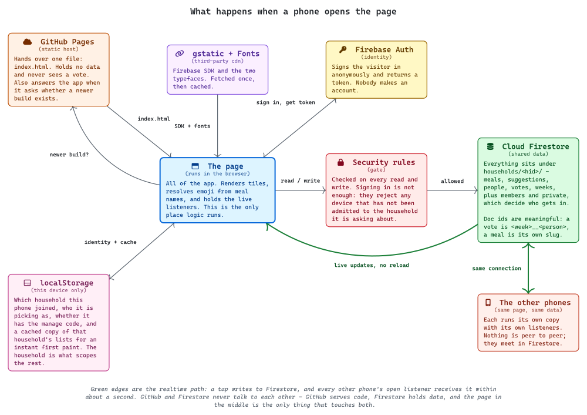
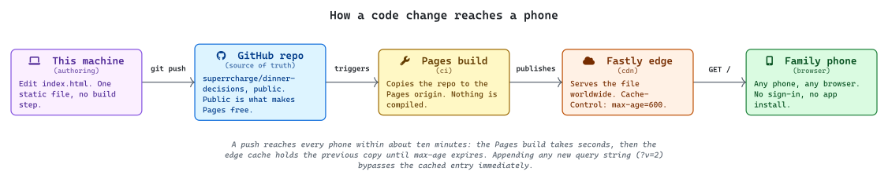

# What's For Dinner

A one-page dinner picker for the family.
Everyone opens the same link on their own phone, taps the meals they'd be happy to eat this week, and whoever does the shopping sees a live tally.

No sign-in, no app.

## How it works

- **Pick meals** - tap tiles to vote. Type anything that isn't on the list and it joins that week's options straight away.
- **Shopping** - meals ranked by votes, with who picked each one and who hasn't voted yet. Build the week's plan by tapping *Add*.
- **Manage** - hidden behind a code. Edit the master meal list, keep or dismiss what the kids suggested, set a meal's icon, clear the week.

The week rolls over on its own every Sunday.

## Layout

Single static file, `index.html`. No build step, no dependencies to install.
Data lives in Firestore, reached with anonymous auth from the browser.

## How it's put together

Two moving parts that never talk to each other: GitHub serves the code, Firestore holds the data, and the page in the browser is the only thing that touches both.

<picture>
  <source media="(prefers-color-scheme: dark)" srcset="./diagrams/runtime-dark.svg">
  
</picture>

Deploying a change is a push. The only thing worth remembering is the ten-minute edge cache.

<picture>
  <source media="(prefers-color-scheme: dark)" srcset="./diagrams/hosting-dark.svg">
  
</picture>

### Regenerating the diagrams

Sources are Typst under `diagrams/`, with the design layer (Primer palette, tokens) in `diagrams/design/`.

```bash
mise run render
```

Needs `typst` and the **CaskaydiaMono NFP** font installed. Each source compiles twice, once per theme, and the fixed pt dimensions are stripped so the SVGs scale to the README's width. The first `mise` run in a fresh clone needs `mise trust`.

## Configuration

Two things in `index.html`:

- `FIREBASE_CONFIG` - the web app config from the Firebase console. The `apiKey` is not a secret; it identifies the project. Access is controlled by the Firestore security rules.
- `MANAGE_PIN` - the code that reveals the Manage tab. It hides Manage from the kids' phones. It is not real security: it sits in the page source, so anyone who opens dev tools can read it.

## Firestore

Collections, all top level:

| Collection | Document id | Holds |
|---|---|---|
| `meals` | slug of the name | the master list |
| `suggestions` | slug of the name | typed-in meals awaiting keep or dismiss |
| `people` | slug plus a random suffix | the household roster |
| `votes` | `<weekId>__<personId>` | one document per person per week |
| `weeks` | `<weekId>` | the meals locked into that week's plan |

`weekId` is the Sunday of the week, as `YYYY-MM-DD`.
A suggestion is given the same id its meal will have, so approving one is a copy across collections and existing votes keep pointing at the right thing.

Rules require an authenticated (anonymous) user and confine writes to those five collections.
The site is public, so anyone with the link can read and write the lists.
